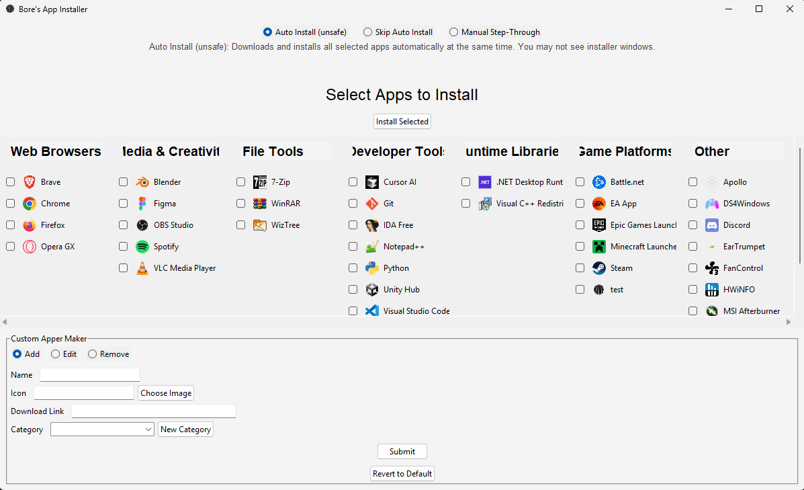

# Bore’s App Installer

Bore’s App Installer is a modern, user-friendly Windows application inspired by Ninite. It allows you to quickly install multiple apps with ease — plus add, edit, or remove your own custom apps and categories for maximum flexibility.

## Features

- **One-click install:** Select multiple apps and install them all at once.
- **Customizable app list:** Add, edit, or remove your own apps and categories via the UI.
- **Flexible install modes:** Choose automatic, manual step-through, or download-only modes.
- **Category management:** Organize apps into categories and manage them easily.
- **Beautiful responsive UI:** Built with Python’s Tkinter and Pillow libraries for smooth experience.

## Getting Started

1. Download the latest release from the **Releases** page.
2. Extract the files if necessary.
3. Run `BoresAppInstaller.exe` to launch the app.

## How to Use

1. **Select apps:** Check the boxes for the apps you want to install.
2. **Choose install mode:**
   - **Auto Install** — installs all selected apps automatically (may require admin permissions).
   - **Skip Auto Install** — downloads installers only, to run manually later.
   - **Manual Step-Through** — installs one app at a time with a “Next App” button.
3. **Click Install Selected** and let the installer do its magic.

## Customizing the App List

- Use the **Custom Apper Maker** section at the bottom of the app to add, edit, or remove apps and categories.
- Organize apps by category for easy browsing.
- Add your own icons by placing image files (PNG/JPG) in the `icons/` folder.
- The app data is stored in `apps.json` — feel free to edit it manually or through the UI.

---

Feel free to do whatever you want with this.
